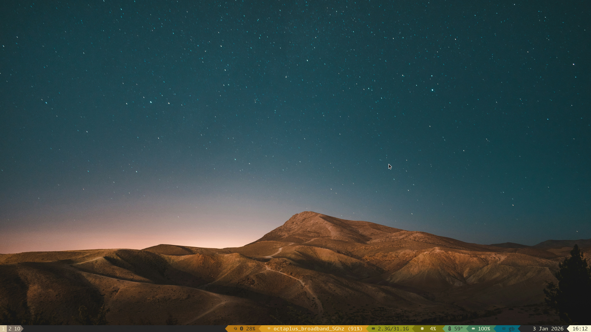
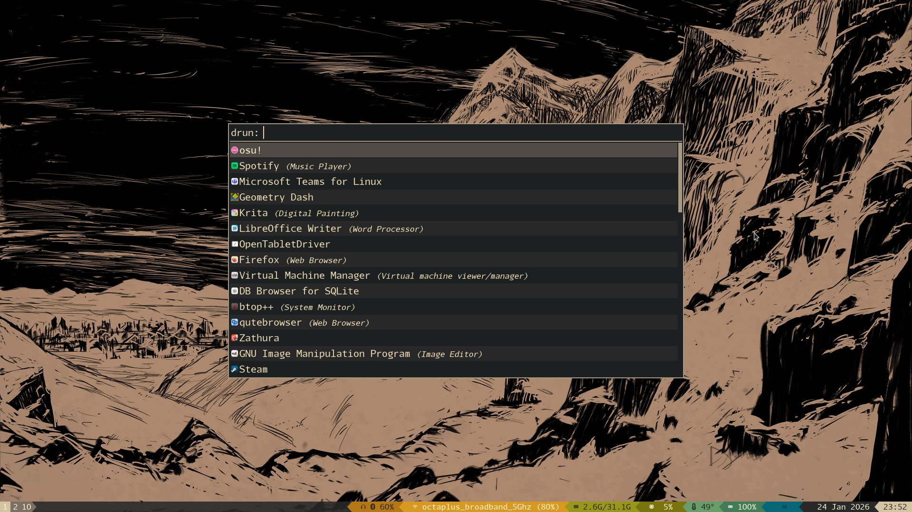
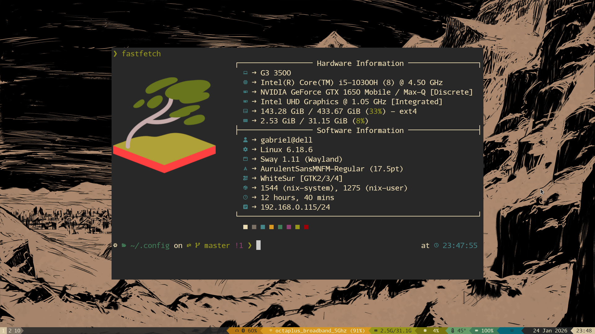
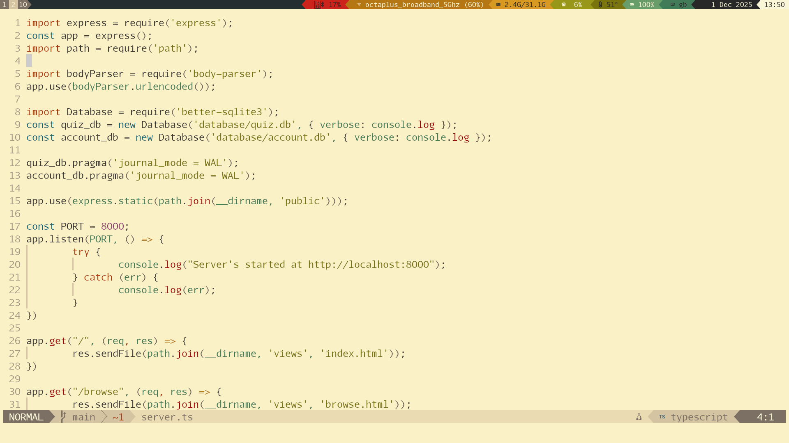

# My NixOS config:
*NOTE: I have random things in my home.nix like "osu-lazer-bin", delete them*
*as you please, I'll try make it obvious whether a package is important or not.*
*Also - shell.nix is an example I set up for a beyond simple python project, it's
*not essential, just a template I/you can use.*

> Colour scheme = Gruvbox light

> Dotfile management = Home-manager\
> Display manager = tuigreet (terminal based)\
> Shell = zsh (with p10k theme and other QOL settings)
> Window manager = Sway (wayland)\
> Bar = Waybar\
> Terminal = Kitty\
> Text editor = Neovim\
> App launcher = Rofi\
> Info-fetcher = Fastfetch 

## Showcase

## File structure
* `nixos/` files go in `/etc/nixos/`,
* `home-manager/` and `modules/` originaly sit in `~/.config`,

- To make Systemd-boot go straight to nixos, edit `/boot/loader/loader.conf`,
  and edit the TIMEOUT to 0. 
- If you execute apply.sh (`./apply.sh`), it'll move all the files to their place, 
  load the configs and install the packages. 
    - Please back up your previous config before running it, and don't execute random 
      scripts from the internet (the script is less than 20 lines long, check it!). 

## Credits:
Waybar config = [mxkrsv/dotfiles-old](https://github.com/mxkrsv/dotfiles-old/tree/master/.config/waybar)
*(I ported the config to nix, and changed the colour scheme and order)*

Colour scheme = [hmorhetz/gruvbox](https://github.com/morhetz/gruvbox)

